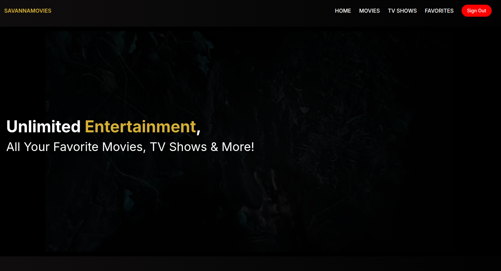
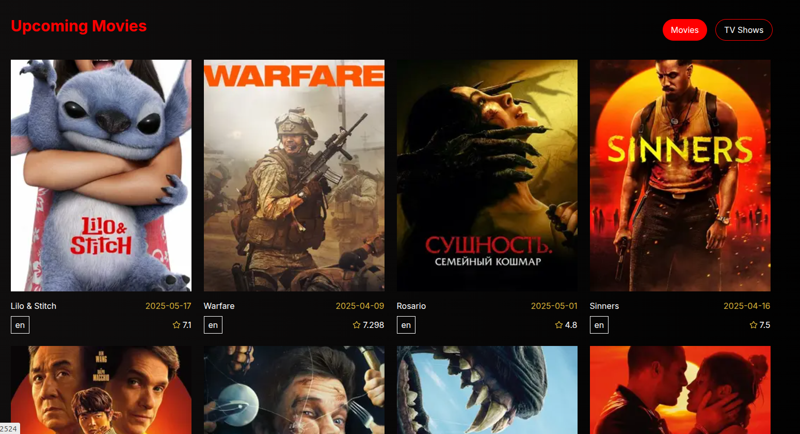
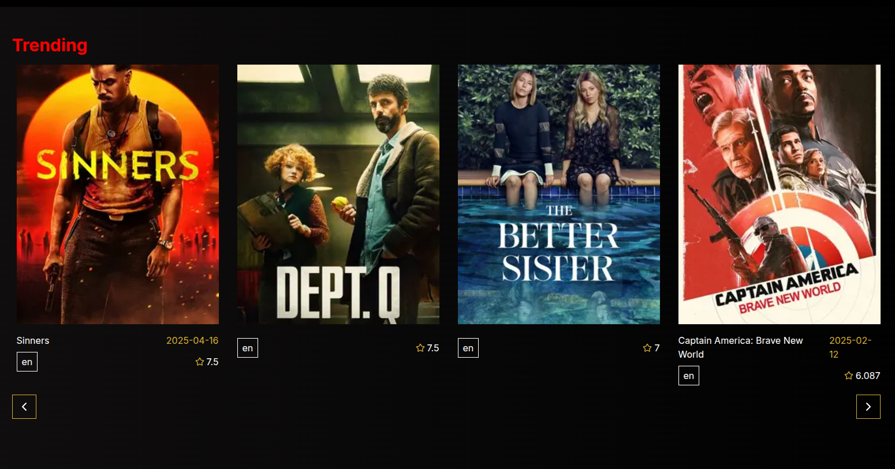
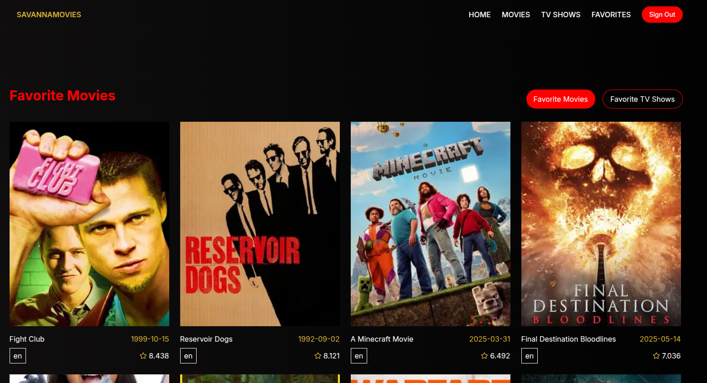

#  SavannaMovies

SavannaMovies is a dynamic and responsive movie web application built using **Next.js** and **TypeScript**, fetching real-time data from the **TMDB (The Movie Database) API**. It allows users to explore movies and TV shows, view upcoming releases, see trending titles, and mark their favorites.

##  Features

- **Browse Movies**: Discover a wide selection of movies by title, date-released, or rating.
- **Explore TV Shows**: Get detailed information and listings for popular TV shows.
- **Trending Section**: Stay up-to-date with the hottest movies and TV shows.
- **Upcoming Movies**: View upcoming movie releases fetched directly from TMDB.
- **Favorites**: Users can mark movies or TV shows as favorites and view them later.
- **Search Functionality**: Quickly search for your favorite content by title.
- **Responsive Design**: Works seamlessly across all screen sizes and devices.

## Tech Stack

- **Framework**: [Next.js](https://nextjs.org/)
- **Language**: [TypeScript](https://www.typescriptlang.org/)
- **API**: [TMDB API](https://developer.themoviedb.org/docs)
- **Styling**: Tailwind CSS 
- **State Management**: React Context

## Screenshots

### Homepage


### Upcoming


### Trending Section


### Favorites Page



## Getting Started

First, run the development server:

```bash
npm run dev
# or
yarn dev
```